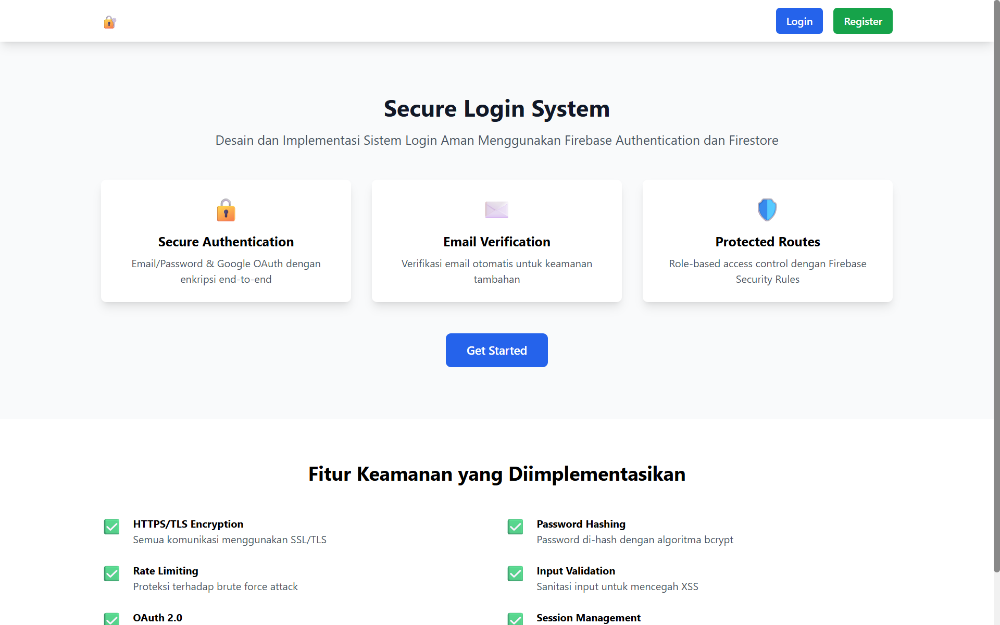

# 🔐 Desain dan Implementasi Sistem Login Aman Menggunakan Firebase Authentication dan Firestore

Proyek untuk Mata Kuliah Cloud Computing dan Security

## 📸 Preview Aplikasi



## 📝 Deskripsi

Sistem autentikasi aman berbasis cloud menggunakan Firebase Authentication dan Firestore Database. Implementasi mencakup multiple authentication methods, email verification, password reset, dan security best practices dengan teknologi modern React dan Vite.

## ✨ Fitur Utama

- ✅ **Email/Password Authentication** - Registrasi dan login dengan email/password
- ✅ **Google OAuth 2.0 Login** - Single Sign-On menggunakan Google
- ✅ **Email Verification** - Verifikasi email wajib untuk keamanan akun
- ✅ **Password Reset** - Reset password melalui email
- ✅ **User Profile Management** - Manajemen profil pengguna
- ✅ **Protected Routes** - Perlindungan rute yang memerlukan autentikasi
- ✅ **Session Management** - Manajemen sesi pengguna
- ✅ **Account Deletion** - Hapus akun dengan konfirmasi keamanan
- ✅ **Real-time Data Sync** - Sinkronisasi data real-time dengan Firestore
- ✅ **Responsive Design** - Desain responsif untuk berbagai device

## 🛡️ Fitur Keamanan

1. **HTTPS/TLS Encryption** - Semua komunikasi terenkripsi end-to-end
2. **Password Hashing** - Firebase menggunakan bcrypt untuk hashing password
3. **Email Verification** - Verifikasi email wajib untuk mencegah account tak terotorisasi
4. **Rate Limiting** - Proteksi brute force attack oleh Firebase
5. **Firebase Security Rules** - Row-level security untuk Firestore
6. **Input Validation** - Sanitasi input untuk mencegah XSS dan SQL injection
7. **OAuth 2.0** - Google authentication dengan standar industri
8. **JWT Tokens** - Session management dengan JWT-based authentication
9. **Content Security Policy** - Header keamanan untuk mencegah XSS
10. **CSRF Protection** - Perlindungan cross-site request forgery

## 🚀 Tech Stack

### Frontend

- **React 18.3** - Library JavaScript untuk UI
- **React Router DOM** - Routing dan navigasi
- **Tailwind CSS** - Utility-first CSS framework
- **Vite** - Build tool dan development server yang cepat

### Backend & Services

- **Firebase Authentication** - Service autentikasi aman
- **Cloud Firestore** - Database NoSQL real-time
- **Firebase Hosting** - Hosting statis (opsional)

### DevOps & Deployment

- **Vercel** - Platform deployment dan hosting
- **Git** - Version control

### Security

- **Firebase Security Rules** - Access control untuk Firestore
- **HTTPS/SSL** - Enkripsi semua komunikasi
- **Security Headers** - CSP, X-Frame-Options, dll

## 📋 Struktur Proyek

```
secure-login-system/
├── src/
│   ├── components/         # Komponen React yang dapat digunakan ulang
│   │   ├── dashboard/      # Komponen khusus dashboard
│   │   ├── forms/          # Komponen form
│   │   └── ui/             # Komponen UI dasar
│   ├── config/             # Konfigurasi aplikasi
│   │   ├── firebase-config.js   # Konfigurasi Firebase
│   │   └── constants.js          # Konstanta aplikasi
│   ├── contexts/           # React Context providers
│   │   ├── AuthContext.jsx       # Context autentikasi
│   │   └── AlertContext.jsx      # Context alert/notifikasi
│   ├── hooks/              # Custom React hooks
│   │   ├── useAccount.js         # Hook untuk operasi akun
│   │   ├── useLogin.js           # Hook untuk login
│   │   └── useRegister.js        # Hook untuk registrasi
│   ├── pages/              # Halaman aplikasi
│   │   ├── Home.jsx              # Halaman beranda
│   │   ├── Login.jsx             # Halaman login
│   │   ├── Register.jsx          # Halaman registrasi
│   │   ├── Dashboard.jsx         # Halaman dashboard
│   │   └── ResetPassword.jsx     # Halaman reset password
│   ├── services/           # Service layer
│   │   ├── auth-service.js       # Service autentikasi
│   │   └── user-service.js       # Service pengguna
│   ├── utils/              # Utility functions
│   │   ├── validation.js         # Validasi input
│   │   ├── error-handler.js      # Error handling
│   │   └── date-utils.js         # Utilitas tanggal
│   ├── App.jsx             # Komponen root aplikasi
│   ├── main.jsx            # Entry point aplikasi
│   └── index.css           # Global styles
├── public/                 # File statis
├── dist/                   # Build output
├── package.json            # Dependencies
├── vite.config.js          # Konfigurasi Vite
├── vercel.json             # Konfigurasi Vercel
└── README.md               # Dokumentasi
```

## 📦 Instalasi

### Prasyarat

- Node.js 18 atau lebih tinggi
- npm atau yarn
- Akun Firebase
- Git

### Langkah Instalasi

```bash
# 1. Clone repository
git clone https://github.com/yourusername/secure-login-system.git
cd secure-login-system

# 2. Install dependencies
npm install

# 3. Buat file .env di root project
# Copy environment variables template dan isi dengan Firebase config Anda
cp .env.example .env

# 4. Edit file .env dengan konfigurasi Firebase Anda
# VITE_FIREBASE_API_KEY=your_api_key
# VITE_FIREBASE_AUTH_DOMAIN=your_auth_domain
# VITE_FIREBASE_PROJECT_ID=your_project_id
# VITE_FIREBASE_STORAGE_BUCKET=your_storage_bucket
# VITE_FIREBASE_MESSAGING_SENDER_ID=your_sender_id
# VITE_FIREBASE_APP_ID=your_app_id

# 5. Run development server
npm run dev

# Aplikasi akan berjalan di http://localhost:5173
```

## 🔧 Konfigurasi Firebase

### 1. Buat Firebase Project

1. Buka [Firebase Console](https://console.firebase.google.com/)
2. Klik "Add Project"
3. Isi nama project dan pilih region
4. Selesaikan wizard pembuatan project

### 2. Enable Authentication

1. Di Firebase Console, buka **Authentication**
2. Klik **Get Started**
3. Pada tab **Sign-in method**, enable:
   - ✅ Email/Password
   - ✅ Google (OAuth 2.0)

### 3. Buat Firestore Database

1. Buka **Firestore Database**
2. Klik **Create Database**
3. Pilih mode **Production**
4. Pilih location (untuk Indonesia: `asia-southeast1` atau `asia-southeast2`)

### 4. Setup Firebase Security Rules

Edit Firestore Security Rules di Firebase Console:

```javascript
rules_version = '2';
service cloud.firestore {
  match /databases/{database}/documents {
    // Users collection
    match /users/{userId} {
      // User can only read/write their own data
      allow read, write: if request.auth != null && request.auth.uid == userId;

      // Allow users to create their own document on registration
      allow create: if request.auth != null;
    }
  }
}
```

### 5. Dapatkan Firebase Config

1. Buka **Project Settings**
2. Scroll ke bawah ke **Your apps**
3. Klik ikon web (`</>`) untuk menambahkan aplikasi web
4. Copy config object ke file `.env` Anda

### 6. Setup Authorized Domains

1. Di **Authentication** → **Settings** → **Authorized domains**
2. Tambahkan domain yang akan digunakan (localhost untuk development, domain Vercel untuk production)

## 🚢 Deployment ke Vercel

### 1. Install Vercel CLI (opsional)

```bash
npm i -g vercel
```

### 2. Deploy via Web

1. Push code ke GitHub
2. Buka [Vercel](https://vercel.com/)
3. Import project dari GitHub
4. Tambahkan Environment Variables (isi dengan nilai dari `.env`)
5. Klik Deploy

### 3. Deploy via CLI

```bash
# Login ke Vercel
vercel login

# Deploy
vercel --prod
```

## 🧪 Pengujian

### Test Manually

1. **Registrasi**

   - Buka `/register`
   - Isi form dan submit
   - Cek email untuk verifikasi

2. **Login**

   - Buka `/login`
   - Login dengan email/password atau Google
   - Verifikasi redirect ke dashboard

3. **Dashboard**

   - Cek informasi user tersimpan
   - Test tombol resend verification
   - Test tombol delete account

4. **Reset Password**
   - Buka `/reset-password`
   - Isi email dan submit
   - Cek email untuk link reset

### Run Build

```bash
# Build untuk production
npm run build

# Preview build
npm run preview
```

## 📊 Firebase Console Usage

Untuk monitoring dan analytics, gunakan Firebase Console:

- **Authentication** → Monitor user sign-ins, active users
- **Firestore** → Lihat data pengguna, database usage
- **Analytics** → Track user behavior (jika enabled)

## 🐛 Troubleshooting

### Error: Firebase configuration incomplete

Pastikan file `.env` sudah dibuat dan semua environment variables terisi dengan benar.

### Error: CORS atau CSP

Check `vercel.json` untuk security headers yang mungkin memblokir resource.

### Error: Firebase Security Rules

Pastikan Firestore Security Rules sudah di-deploy dengan benar di Firebase Console.

## 📚 Resources

- [Firebase Documentation](https://firebase.google.com/docs)
- [React Documentation](https://react.dev/)
- [Vite Documentation](https://vitejs.dev/)
- [Tailwind CSS Documentation](https://tailwindcss.com/)
- [Vercel Documentation](https://vercel.com/docs)

## 👥 Contributors

- **Liza Najwa Zahara** - NIM: 230170086
  - Email: liza.230170086@mhs.unimal.ac.id
  - Universitas: Universitas Malikussaleh

## 📄 License

MIT License - lihat file [LICENSE](LICENSE) untuk detail lebih lanjut.

## 🙏 Acknowledgments

- Firebase team untuk platform autentikasi yang luar biasa
- React community untuk library dan dokumentasi yang komprehensif
- Vercel untuk platform deployment yang user-friendly

---

**Note**: Pastikan untuk tidak commit file `.env` ke repository. File ini mengandung credential sensitif. Gunakan `.gitignore` untuk mencegahnya ter-commit.
